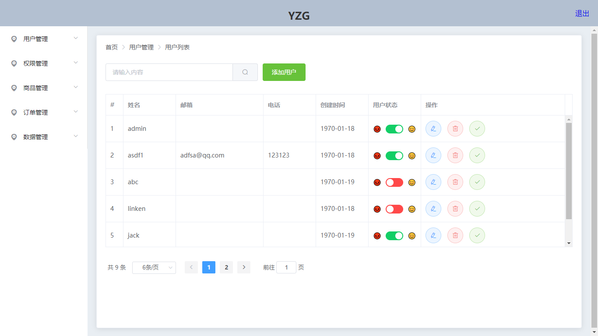
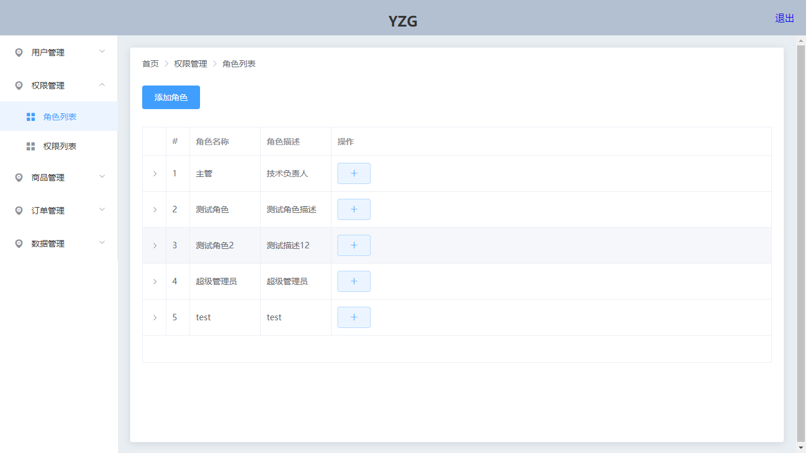
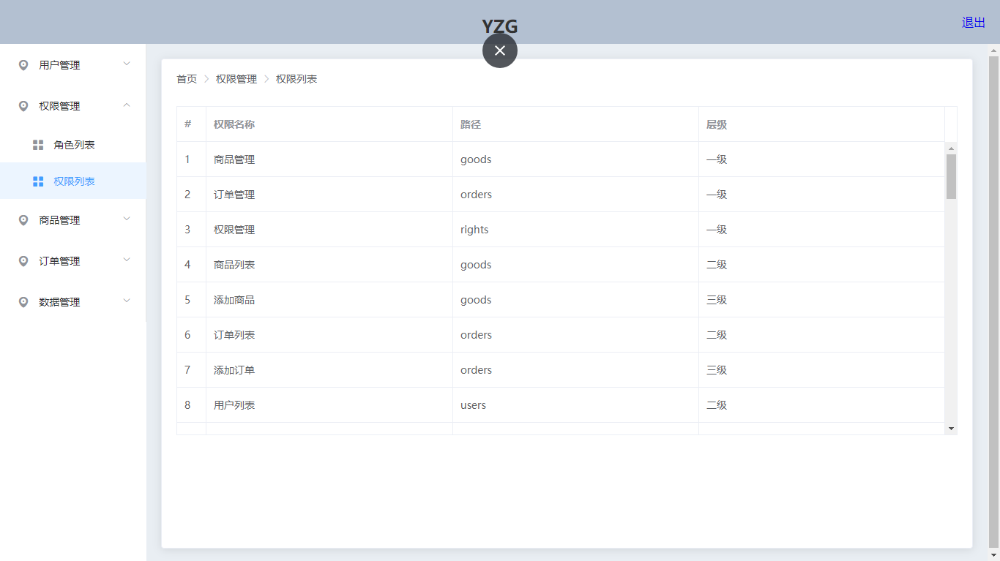
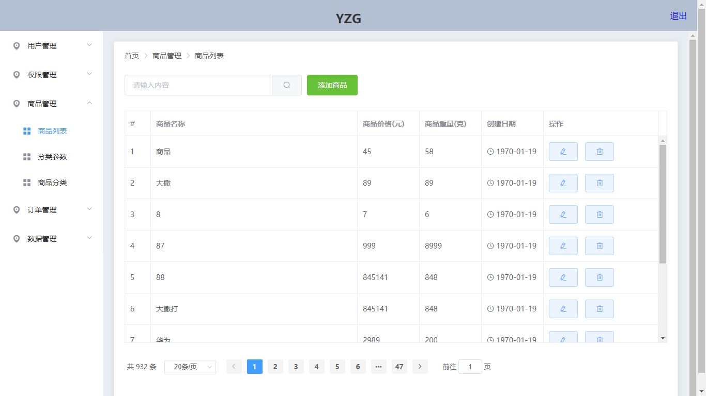
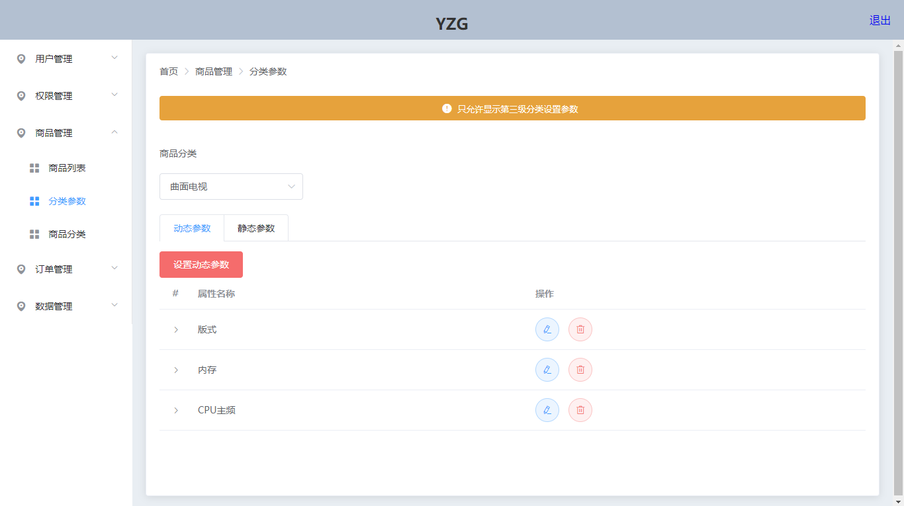
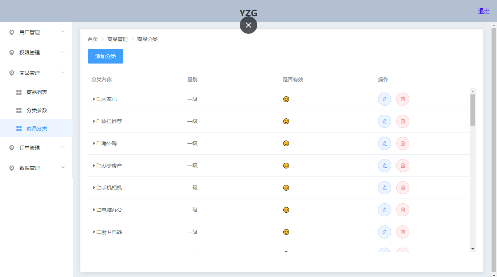
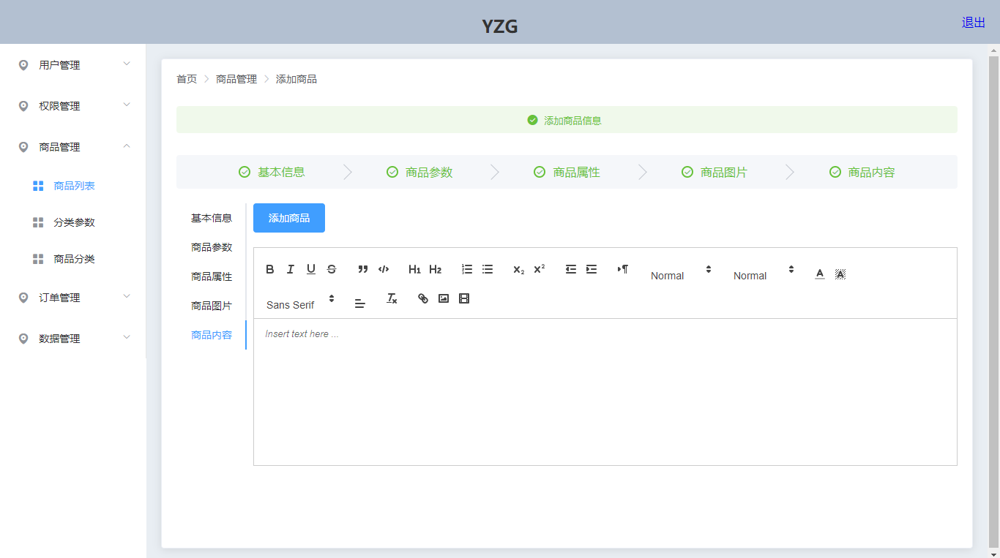
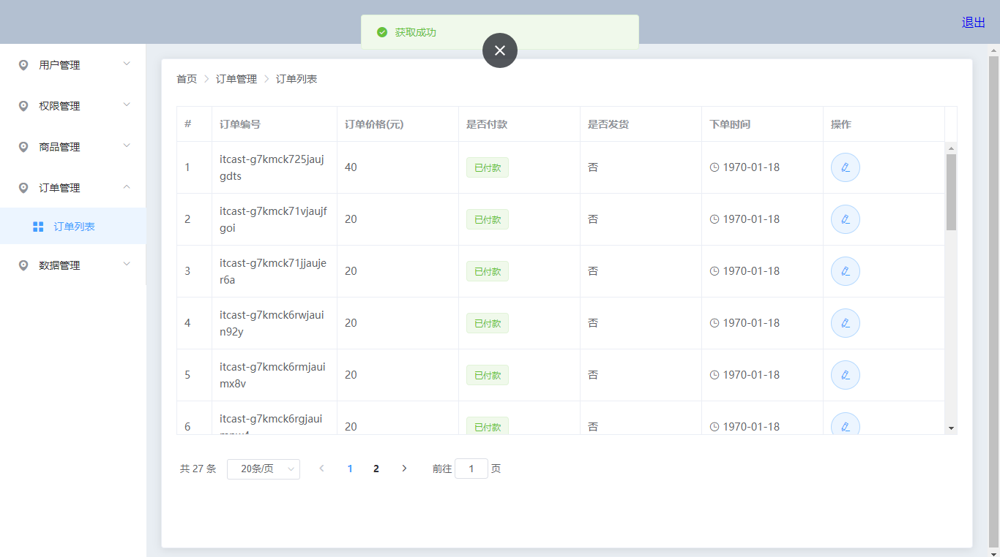
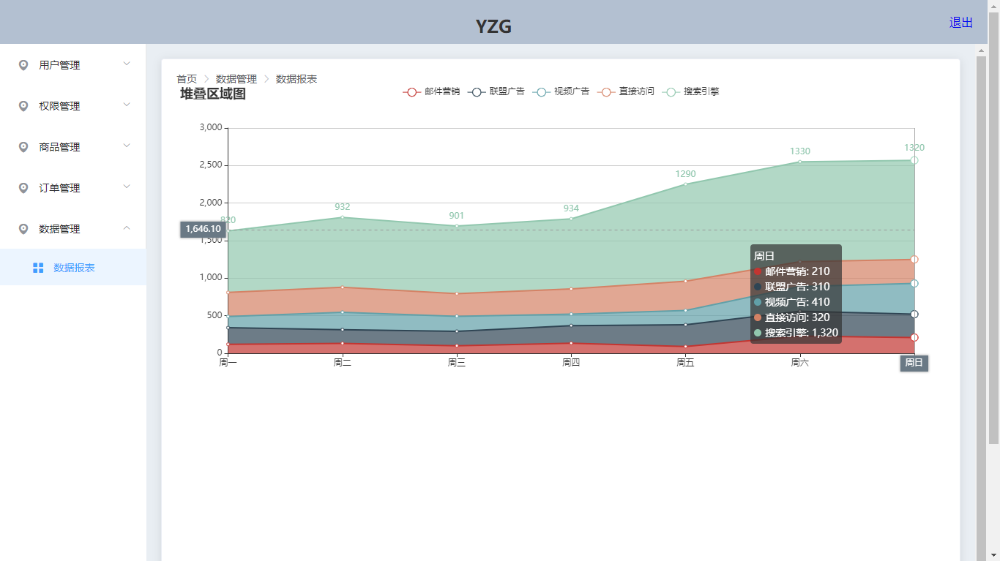

# vueadmin基于vue ElementUI vue-router es6 webpack+vue-cli构建的前端后台项目

## Build Setup

```bash
# install dependencies
npm install

# serve with hot reload at localhost:8080
npm run dev

# build for production with minification
npm run build

# build for production and view the bundle analyzer report
npm run build --report
```

## 模块

### 用户管理模块

#### 用户列表
> 

### 权限管理模块

#### 角色列表
> 
#### 权限列表
> 


###  商品管理模块

####  商品列表
> 

####  分类参数
> 

####  商品分类
> 

#### 添加商品
> 

### 订单管理模块

####  订单列表
> 

### 数据管理模块

#### 数据报表
> 
## 项目结构
```bash
├─commom 公共模块
│  ├─breadcrumb 封装的面包屑组件
│  └─style 重置样式
├─components
│  ├─addGood 添加商品
│  ├─categories 商品分类 
│  ├─cateparams 分类参数
│  ├─dataReport 数据报表
│  ├─goodList 商品列表
│  ├─home 主页
│  ├─login 登陆页面
│  ├─orderList 订单列表
│  ├─permission 权限列表
│  ├─roleList 角色列表
│  └─users 用户列表
├─plugins 封装的axios
└─router 路由

```

